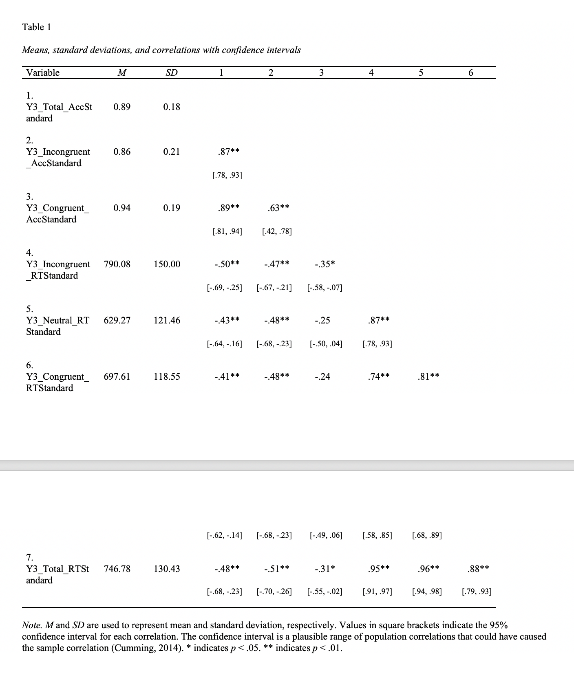

# Libraries


```{r message=FALSE, warning=FALSE}
#Here are a bunch of libraries that you may or may not need


library(agricolae) #used for simple effects
library(apaTables) #makes apa-formatted tables
library(broom) #converts objects so they can be used by tidy and ggplot
library(devtools) #tbh i dont know, but i think it helps with other packages
library(e1071) # for skew stats
library(effects) #glm stuff, i think
library(ez) #anovas, rm anovas
library(GGally) #addon for GGplot2
library(ggmap) #maps
library(ggplot2) #the prettiest graphs you ever did see
library(gridExtra) #nice tables for grobs
library(hexbin) #density graphs 
library(HH) #i dont remember!! 
library(Hmisc) #arranging grobs, writing things as.numeric etc.
library(kableExtra) #tables for html
library(knitr) #lets you do extra stuff when you knit to html
library(lme4) #linear mixed effects models
library(lsr) #used for etaSquared 
library(MBESS) #needed for some apa tables
library(multcomp) # i don't remember!!! 
library(nlme) #more linear model stuff (and nonlinear)
library(plyr) #for splitting, combining data 
library(psych) #basically all the most basic stats in r 
library(purrr) #more layout/visual stuff for grobs
library(RColorBrewer) #makes everything beautiful and colorful
library(readxl) #lets you import from excel
library(reshape2) #helps you reshape data, put in longform, etc
library(rgeos) #maps
library(rnaturalearth) #maps
library(rnaturalearthdata) #maps 
library(scales) #for making those color mapped correlations 
library(sf) #maps
library(stargazer) #makes nice tables for sweave,html
library(texreg) #puts output to html tables 
library(tibble) #colnames and rownames. also good for grobs
library(tidyr) #more data manipulation stuff
library(xtable) # i dont remember, again! 
library(lmerTest) 
library(robustlmm)
library(WRS) # Rand Wilcox's package for robust stats
library(WRS2)

library(esc) #effect size calculators

#for whatever reasaon, this package needs to be loaded last
library(dplyr) #helps with summary tables


```

# R Basics

In its most simple form, you can use R as a glorified calculator. TO run a line, hit "COMMAND ENTER". To run a whole chunk, you can press the green play button in the top right. 

Arithmetic
```{r}
1+2
5-2  
2*3
```

Order of operations
```{r}
2^4* 0.2+ sqrt(6)-abs(-3)  +2 *pi + 3/(4/5)
```

Creating lists. Use "c" 
```{r}
a=c(5,4,1,2,13,6,7,8)
```

how long is your list? 
```{r}
length(a)
```

indexing- grab a single value from a list, or multiple values
```{r}
a[3]
a[4:8]
a[-4] #take out the fourth item in  the list 
a[1]=300 # appending in avalue
a=c(a, 5, 20) #appending into multiple values
```

rbind vs. cbind: what is the difference?
```{r}
b=c(1,2,3,4,5,6,7,8,9,10)
b
b=1:10
b

M1=rbind(a,b);M1
M2=cbind(a,b);M2
```


# Data Manipulation 

You *gotta gotta gotta* know how to manipulate your data, or else you will spend HOURS trying to figure out why your stats aren't running and why your graphs look like abstract art. 

## Data Import

Note: this dataset is for the Flanker Fish task from the executive function battery. It includes:
 -3 groups (M,S,C)
 -2 Years
 -3 Blocks/Year
 -3 Conditions/Block
 -Accuracy, RT
 
 Additional variables are things like gender, age, WASI, etc. that we will use in different tests. 
 
 Again, *this is fake data*!!!!!
 
```{r}
flanker <- read_excel("/Volumes/MusicProject/Individual_Projects/R/Comprehensive_R/Sample_Data/SampleData_Flanker.xlsx")
```

## Data at a Glance 

Something pretty important in R is being able to look at your data quickly. 

```{r}
#look at your headers and some data 
head(flanker)

#look at the names of your variables
names(flanker)
```
To check how many rows/columns you have, you can use the length function
```{r}
length(flanker$ID) #this is # of subjects (rows)

length(flanker) #this is # of variables (columns)
```


Also important is the class of your variables. 

Class is imporant because it determines what kinds of stuff you can do with a variable. Factoring gets R to recoognize something as categorical, for example.

To change the class of a variable, simply write:
```{r}
#dataframe$variable = as.NEWCLASS(dataframe$variable)

#to look at the class of one variable
class(flanker$Gender)
#to look at the class of all variables
lapply(flanker, class)

```

Attributes is basically everything you might want to know about how R recognizes your data.
You can do it for an entire dataframe, or for a single variable

```{r}
attributes(flanker$Gender)
```

## Factoring

Factoring is necessary in order for R to recognize things as different categories rather than individual characters, numbers, etc. 

```{r}
flanker$Group = as.factor(flanker$Group)
flanker$Gender = as.factor(flanker$Gender)

as.factor(flanker$Group)
#check that it is factored
class(flanker$Gender)

#now look how the attributes change
attributes(flanker$Group)
attributes(flanker)
```

## Labelling things by group

This creates new dataframes. This can be helpful when running analysis, or just if you want to see summaries between groups very quickly
```{r}
music = flanker[which(flanker$Group == '1'),]
sport = flanker[which(flanker$Group == '2'),]
control = flanker[which(flanker$Group == '3'),]

```

## Changing the order of things 

**THERE IS A WRONG AND A RIGHT WAY TO DO THIS.**

**HERE IS THE WRONG WAY** (I'm not even going to put it in real code because it is *THAT BAD*)

```{r}
# flanker$Group == factor(flanker$group, levels = c("1", "2", "3"), labels = c("2", "3", "1"))
```

*If you do the above, you are DOOMED to fail. You are just relabelling your data and swapping the NAMES of your factors, not the ORDER *

**HERE IS THE RIGHT WAY:**

```{r}

flanker$Group = factor(flanker$Group, levels=c("3","2","1"))

#but i dont actually want that so we're gonna change it back now

flanker$Group = factor(flanker$Group, levels=c("1","2","3"), labels=c("Music", "Sport", "Control"))
```

## Changing Individual cells
```{r}
flanker[1,4]
flanker[1,4] = 'F'

#row 1, column 4
```

## Removing NA's

NA's cause lots of problems in analysis. Lots of stats will not run if you have NA's. 
```{r}
flanker_noNA = na.omit(flanker)
length(flanker$ID)
length(flanker_noNA$ID)
```

## Removing an entire row
```{r}
flanker
flanker = flanker[-1,]
length(flanker$ID)
#length(flanker2$ID)
#to remove an entire column, do flanker[,-1]
```

## Separating Data
You can also call by variable name.
```{r}
flanker_demos = select(flanker, ID, Group, Age, Gender)
```

```{r}
flanker_standard = flanker[,c(1:13,31:38)]
```

## Combining Data
```{r}
y3 = read_excel("/Volumes/MusicProject/Individual_Projects/R/Comprehensive_R/Sample_Data/y3standard.xlsx")

#lets just manipulate it the same way, for simplicity
y3[1,4] = 'F'
y3 = y3[-1,]
flanker_standard = merge(flanker_standard, y3, by = "ID")

#do this stuff again
flanker_standard$Group = as.factor(flanker_standard$Group)
music_st = flanker_standard[which(flanker_standard$Group == '1'),]
sport_st = flanker_standard[which(flanker_standard$Group == '2'),]
control_st = flanker_standard[which(flanker_standard$Group == '3'),]
```

## Outliers
Great. Now you have some nice data. But is it really what you want?
What about outliers? Lets go ahead and figure out what those are and decide if we want to remove them. 

Let's do it by group. 
```{r}
# DEAR ALISON, PLEASE HELP
# We will name our no-outliers data set "flanker_standardno", but for now, until we do that, i will just make it the same. 

flanker_standardno = flanker_standard
```

## Long Form
Ok. This is great and all, but you can't really do very many stats on it, because it is in wide format. 

Please note: this dataset was organized very carefully (only for the Standard block, ha ha), so that the Underscores separated the different variables. For example: 

*Y4_Total_AccStandard* will create 3 rows: *Year = 4, Condition= Total, Var = AccStandard*

There are other ways to do this, like many things in R, but this appears to be the most efficient IF you set up your headers correctly

```{r}
flanker_long <- flanker_standardno %>%  
  gather(key = var, value = val, -(ID:WASI)) %>%  #gather by these, exclude columns ID through WASI $
  separate(var, c("Year","Condition","var")) %>% #separate by these (what your new columns will be)
  spread(key = var, value = val) 

#gotta factor those conditions
flanker_long$Condition = as.factor(flanker_long$Condition)
flanker_long$Year = as.factor(flanker_long$Year)

#for some reason, by values are characters. not ideal 
flanker_long$AccStandard = as.numeric(flanker_long$AccStandard)
flanker_long$RTStandard = as.numeric(flanker_long$RTStandard)


```

***


Another way to make things long, for more simple data, is to use melt. A little more work-intensive
```{r}
#Lets say you just had a simple data set like this
rt <- read_excel("/Volumes/MusicProject/Individual_Projects/R/Comprehensive_R/Sample_Data/Simple.xlsx")

#fix it up
rt$group = as.factor(rt$group)
rt$year = as.factor(rt$year)
rt$ID = as.factor(rt$ID)
rtlong = melt(data = rt, id = c('ID','group', "year"))
```

**MAJOR KEY!!!!!: BEFORE YOU RENAME YOUR COLUMNS, CHECK TO MAKE SURE THEY ARE IN THE RIGHT ORDER!!!!!! OTHERWISE, VAST CONFUSION MAY OCCUR**


```{r}
#rename the columns
colnames(rtlong) = c("ID", "Group", "Year", "Condition", "RT")
```

## Removing incomplete data

Ok, but there is one more problem: we can't really look at results across years with simple RMANOVA unless all the participants have data for each year. So, we remove those that don't have all years. This can be done with the na. omit thing when in WIDE form, or it can be done by removing subjects that don't have more than x number of iterations of their ID (if you already have long form data)

Let's go back to our original dataset *(flanker_long)*

The ">" term should be one less than your max number of iterations. So, I want each participant to have 12 data points, in this case (4 for each of the 3 years (total, incongruent, congruent, neutral)). If someone has less than 12, they are OUT. 

```{r}

flanker_long = flanker_long[flanker_long$ID %in% names(table(flanker_long$ID)) [table(flanker_long$ID) >11],] 

# so basically: flanker_long = only those where the participant shows up more than 11 times, because that means they have all data points for each year

```


***


ONE LAST THING. the long data includes something called "total". we don't want that because that is just a sum of everythign else! lets remove it.

```{r}
fullflanker_long = flanker_long #save it incase we need it
flanker_long = flanker_long[flanker_long$Condition !="Total",]
```

## Summary Table
Cool! Let's make a summary table now. These are helpful when we go to make graphs (later on), but they are also just generally nice to look at your summary stats 

```{r}
flankersum_acc = ddply(flanker_long, c("Group", "Condition", "Year"), summarise,
                     N = length(AccStandard), # calculates # of individuals per group by year
                     mean = mean(AccStandard), # calculates mean for each group by year
                     sd = sd(AccStandard), # calculates sd for each group by year
                     se = sd / sqrt(N))

flankersum_rt = ddply(flanker_long, c("Group", "Condition", "Year"), summarise,
                     N = length(RTStandard),
                     mean = mean(RTStandard), 
                     sd = sd(RTStandard), 
                     se = sd / sqrt(N))
```

# Statistics

Woohoo! We are now moving on to statistics! Below are some very basic stats tests you might want to run. 


## Choosing a Test

**Which test do I use??**
Excellent question. 
[Here](https://stats.idre.ucla.edu/other/mult-pkg/whatstat/) is a nice website with detail and R/SPSS code, that you can use to make those decisions.

Additionally, below are two types of decision trees that are helpful. 

It should be noted that the images below outline pretty old methods of statistics that are not super robust, meaning you may compromise some statistical power and potentially get some misleading results. As noted above, this is not a statistics course, so we will not be going into the math behind such arguments. Please use the images below with caution, as a place to *start*. There are lots of other more robust methods to carry out all of these analyses. [We recommend this book by Rand Wilcox.](https://www.amazon.com/Modern-Statistics-Social-Behavioral-Sciences/dp/1439834563)

**Tests for Association**


**Tests for Differences**


## Descriptive Stats

You can also.... look at your summary spreadsheets!
```{r message=FALSE, warning=FALSE}
#basic summary
summary(flanker_long)

#these work best with wide data
describe(flanker_standard)
describe(flanker_standard$Age)
describeBy(flanker_standard,group = flanker_standard$Group)
```

## Assumption testing

DISCLAIMER: Basically all of basic statistics relies on a set of assumptions, namely that your data is normally distributed and has homogeniety of variance. It would be really lovely if we could just test these assumptions, make sure the tests don't fail, and then move on to using our classic tests. However, that is not how this works. The shapiro test is good at telling you when your data is NOT normal (you can trust that one), but just because it doesn't fail doesn't mean that you can accept that it is normal. Basically, even if you test for things, you never really know. So, please use classic methods with caution. 

**Normality and Skewness**

```{r}
skewness(flanker_long$Age)
```
**What is this??**

Skewness is a measure of symmetry, basically. 
Negative skewness = mean < median (left skew)
Positive skewness = mean > median (right skew)

When you should worry: >1.96 or < -1.96

A perfectly non-skewed data is where the mean = median, skewness = 0.

**Kurtosis**
```{r}
kurtosis(flanker_long$Age)
```
**What is this??**

Kurtosis is similar to skewness, in that it measures the data's distriution.
It measures the tail shape of the data distribution/ how "peaked" the distribution is. 

A thin-tailed data distribution has too much data in the middle.
A fat-tailed data distribution has too much data on the tails. 

A perfect normal distribution has 0 excess kurtosis. 

The acceptable range for this is similar to skewness, above. 

**Test for normality**
```{r}
shapiro.test(flanker$Y4_Total_AccStandard)
```
if it fails (nonnormal), p is less than 0.05.


**How to report**

> "Age was normally distributed with skewness of 0.06 and kurtosis of -0.93."


## Categorical Data Analysis

Categorical data is data that is not continuous. These include variables like Gender, or things that have a yes or no answer. We can look at this data in many ways, but here is one. This test will tell us if there are gender differences between groups. 

### Chi-Square
```{r}
chisq.test(flanker_long$Group, flanker_long$Gender)
#interpret what it means with your summary data
```
**What is this??**
This tests if 2 categorical variables are related in some population. 

If the p value is less than p < 0.05, we reject the null hypothesis that the distribution of the variables are independent. Basically, the groups differ in gender distribution.

**How to report** 

> "An association between group and gender was observed, χ2(2) = 36.27, p < 0.01."

## 2 independent groups

### T test
```{r}
t.test(music$Y4_Total_AccStandard, control$Y4_Total_AccStandard)
```

### Wilcox (nonparametric)
This is the classic non-parametric alternative to the t test. It is HORRIBLE if you have tied values. So watch out for that.
```{r}
wilcox.test(music$Y4_Total_AccStandard, control$Y4_Total_AccStandard)
```

### Cliff's (robust)

This is a robust alternative to the t test and it performs well even with tied values. It tests three different hypotheses (equal, greater, less than). 
```{r}
cid(music$Y4_Total_AccStandard, control$Y4_Total_AccStandard)
```

This plot shows the distribution of D, wehre D is the difference between a randomly sampled observation from group1-randomly sampled observtion from group2. D will be symmetric around 0 when distributions are identical. 
```{r}
cidv2(music$Y4_Total_AccStandard, control$Y4_Total_AccStandard, plotit=TRUE)
```


## More than 2 independent groups
### 1 Way ANOVA

This works for Wide
```{r}
summary(aov(Y4_Total_AccStandard ~ Group, data = flanker_standard)) 
```

***

But also for long

```{r}
model1 = (aov(AccStandard ~ Year, data = flanker_long)) 
summary(model1)
```

## Between/within

### 2-Way ANOVA

But lets say you wanted to look at 2 variables. You might want to do a 2way anova. 

```{r}
summary(aov(AccStandard ~ Condition * Group + Error(ID/(Condition*Group)), data = flanker_long))
```
### With aCovariate

If, for example, you had group differences in Age, you might want to add it in as a co-variate. 

Just change that * to a +
```{r}
summary(aov(AccStandard ~ Condition + Age, data = flanker_long))
```

### Bootstrap methods (ROBUST!)
see page 441 of Rand's book. (11.6.3) please read to understand how boostrapping works. This is probably the most robust way to do a between/within analysis. You can also just do a single within or single between.


Data setup
```{r}
#isolate your variable into a single dataset
flanker_avonly = flanker_long[,c(1,2,6,8)] 

#put in list mode
z= fac2list(flanker_avonly[,4], flanker_avonly[,c(2,3)])

# between data (group) is in column 3
# within data (time) is column 2
# data (average) in column 4
```


```{r, error = TRUE}
# Main effect of Group
sppba(3,3,z, est= tmean, nboot = 5000)

# Main effect of Time
sppbb(3,3,z,est = tmean, nboot = 5000)

# Group x Time
sppbi(3,3,z, est = tmean, nboot= 5000)
```

## Effect Size Calculators

When reporting statistics in papers, you need to include eta squared, or effect size. These values do not immediately appear with this call. So, you have to do this:
```{r}
etaSquared((aov(AccStandard ~ Year * Group, data = flanker_long)), type = 2, anova = FALSE)
```

Because, especially older papers, sometimes dont report it! Here is how to calculate it.

## Hedge's g 

kind of like cohen's d, but reduces bias

### from mean and sd
```{r}
esc_mean_sd(grp1m = 41.98, #mean of the intervention group
            grp1sd = 2.47, #SD of the intervention group
            grp1n = 18, #n of the intervention group
            grp2m = 43.17, #mean of other group
            grp2sd = 3.69, #SD of other group
            grp2n = 15,  #n of the other group
            es.type = "g")#effect measure, can put "d" for cohens d
```

### from 1way anova
```{r}
esc_f(f=5.13, #F value from the anova
      grp1n = 13, #number of participants in group 1
      grp2n = 13, #number of participants in group 2
      es.type = "g") 

```


### from mean and SE
```{r}
esc_mean_se(grp1m = 8.5, 
            grp1se = 1.5, 
            grp1n = 50,
            grp2m = 11, 
            grp2se = 1.8, 
            grp2n = 60, 
            es.type = "g")
```
### from regression

Unstandardarized
```{r}
esc_B(b=3.3, #unstandardized coef. b (treatment predictor)
      sdy=5, #sd of the dependent variable y
      grp1n = 100, #n of first group
      grp2n = 150, # n of second group
      es.type = "g")
```

Standardized
```{r}
esc_beta(beta=0.7, sdy=3, grp1n=100, grp2n=150, es.type = "g")

```

### from chi sq

```{r}
esc_chisq(chisq=9.9,totaln=100,es.type="cox.or")
```

### from correlation
```{r}
esc_rpb(r = 0.25, grp1n = 99, grp2n = 120, es.type = "g")
```


### from indep. t test
```{r}
esc_t(t = 1.12, grp1n = 16, grp2n = 17,es.type="g")
```

### from cohens d
```{r}
hedges_g(d = 1.484, totaln = 46)
```
### from regression

#### unstandardized coef
```{r}
esc_B(b=3.3,
      sdy=5,
      grp1n = 100,
      grp2n = 150,es.type = "g")
```

#### standardized coef
```{r}
esc_beta(beta=-0.279, 
         sdy=0.013,
         grp1n=74,
         grp2n=89, 
         es.type = "g")

```


## Post Hocs, using AOV
```{r}
TukeyHSD(aov(AccStandard ~ Year, data = flanker_long))
```
**What is all of this??**

We use ANOVA to determine if there are any statistically significant differences between groups on a given dependent variable. 

The null hypothesis states that the groups are *all the same*, and that the means are *not* statistically different from each other. 

If a significant difference is found, it is called a **main effect**, and must then be interpreted using a post-hoc test. It spits out something called an **F ratio**, which is  **F = variation BETWEEN samples/ variation WITHIN samples**. The null hypothesis says that the F ratio is 1. 

So, if it is greater than 1, it means that the variation BETWEEN your sample is greater than the variation WITHIN your sample. This means that there is something acting upon your data that makes a change in it that is OUTSIDE of the variation the comes from within individuals.

Post hocs let you know where that main effect is coming from. They are *a posteriori* tests, which mean that they are performed *after* the ANOVA. Performing them before the ANOVA will increase your chances of obtaining a Type 1 error (false positive), and is generally considered poor practice. 

However, there is also an argument that states that using any kind of post hoc AFTER doing your global test(like an f test) completely changes the properties of the post hoc... and you're not really testing what you think you're testing. So, things to think about. 

**How to report**

> "A 1-Way ANOVA revealed a main effect of Year on accuracy, F(2,420) = 11.85, p < 0.001,η2 = 0.05. Post-hoc analysis using Tukey's HSD indicated that participants were more accurate Year 5 than Year 3 (p < 0.001), and Year 4 (p < 0.001)."

## RM ANOVA
Looking across years, it is helpful to do a repeated measures ANOVA
```{r message=FALSE, warning=FALSE}
flanker_anova = ezANOVA(data = flanker_long, 
                    dv = AccStandard, 
                    wid = ID,
                    within = c(Year,Condition),
                    between = Group,
                    detailed = F)
```
It will likely tell you your data is unbalanced and that is just how it is!!! who can have perfect retention, really?

Now, see the results. 
```{r message=FALSE, warning=FALSE}
print(flanker_anova)
```

**What does this mean??**

Like a 1-way ANOVA, a RM ANOVA looks at related but not indpedendent groups. It allows us to look at groups over time. 

Here, you can look at an an **interaction effect** as well as any main effects. Interaction effects show how two things are related as a function of some other thing! 

**How to report**

> "A repeated-measures ANOVA revealed a significant main effect of ___(see above). A significant Year*Group interaction effect was also observed, F(4,88) = 5.95, p< 0.001,η2 = 0.06. Follow-up analyses indicated that the music group had significantly higher accuracy than the control group, only at Year 5 (p< 0.05)."

### Sphericity Assumptions

Look! above, it shows you the sphericity assumptions AND the effect sizes. How great is that.


What are **sphericity assumptions**?
Sphericity is the assumption of a RM ANOVA, where the variances of the differences between all the possible pairs of a *within subjects condition* are equal. For example, the variances of Y3 and Y4, and Incongruent and Congruent are equal. When violated, you can get an F-ratio that is inflated. 

Mauchly's test of Sphericity tells you whether or not the assumptions are violated, by giving a p value. When the probability of Mauchly's test is < 0.05, the assumption has been violated. Therefore, we can conclude that there are *significant differences between the variances of differences. 

This test is required when you have more than 2 levels of a given within subjects condition. Here, we have 3 years and 3 conditions, so we definitely should look at it. 

*GGe* = greenhouse-geisser epsilon (what you report below)
*pGG* = Adjusted p value

you also need the corrected degrees of freedom. Calculate that by:

*df(n) x GGe*, *df(d) x GGe*
```{r message=FALSE, warning=FALSE}
dfn_corrected = (flanker_anova$ANOVA$DFn[5])*(flanker_anova$`Sphericity Corrections`$GGe[5])
#[5] is the row that you are specifying
print(dfn_corrected)

dfe_corrected = (flanker_anova$ANOVA$DFd[5])*(flanker_anova$`Sphericity Corrections`$GGe[5])
print(dfe_corrected)
```

```{r include=FALSE}
meta = (flanker_anova$`Sphericity Corrections`$GGe[5])
```

*When it is violated*, you need to correct the degrees of freedom. 

**How to report**

> "Mauchly's test indicated that the assumption of sphericity had been violated for the Year by Condition interaction, therefore degrees of freedom were corrected using Greenhouse-Geisser estimates of sphericity (ε = `r round(meta,2)`), F(`r round(dfn_corrected,2)`,`r round(dfe_corrected,2)`) = `r round(flanker_anova$ANOVA$F[7],2)`, p < 0.001."  

People sometimes report the chi-squared but, tbh I dont know where that comes from and I've rarely seen it. Sometimes people don't even put anything, they just say "Sphericity corrections using G-G were used when appropriate", and its assumed that if you have a weird-ass DF, that is the reason why. 


### Simple Effects

What do the main effects mean??
```{r}
output = lme(AccStandard ~ Year, 
             random = ~1|ID, 
             data =flanker_long, 
             method = "ML") 
tukey = glht(output, linfct = mcp(Year = "Tukey"))
summary(tukey)
```

***


Ok, but what do all of those interaction effects mean? Let us explore with a simple effects test. Let's just pretend, first that we had a YEAR BY GROUP interaction.

First, split up into separate data sets. 
```{r}
Y3 = subset(flanker_long, Year == "Y3")
Y4 = subset(flanker_long, Year == "Y4")
Y5 = subset(flanker_long, Year == "Y5")
```

Then, run ANOVAs on group within each year

```{r}
Y5Out = aov(AccStandard ~ Group, data = Y5)
Y4Out = aov(AccStandard ~ Group, data = Y4)
Y3Out = aov(AccStandard ~ Group, data = Y3)
summary(Y5Out)
summary(Y4Out)
summary(Y3Out)

```

Do a post of to find any sig differences between groups in each year
```{r}
HSD.test(Y5Out, "Group", group = FALSE, console = TRUE)
HSD.test(Y4Out, "Group", group = FALSE, console = TRUE)
HSD.test(Y3Out, "Group", group = FALSE, console = TRUE)
```


Ok, now let's actually look at our pretend YEAR * GROUP * CONDITION interaction

So keep those subsets. 

Run a RM anova for group * condition within each year
```{r}
flanker_anova3 = ezANOVA(data = Y3, 
                    dv = AccStandard, 
                    wid = ID,
                    within = Condition,
                    between = Group,
                    detailed = F)
print(flanker_anova3)

flanker_anova4 = ezANOVA(data = Y4, 
                    dv = AccStandard, 
                    wid = ID,
                    within = Condition,
                    between = Group,
                    detailed = F)
print(flanker_anova4)

flanker_anova5 = ezANOVA(data = Y5, 
                    dv = AccStandard, 
                    wid = ID,
                    within = Condition,
                    between = Group,
                    detailed = F)
print(flanker_anova5)
```

So it looks like it's not a group * condition effect, based on year. 
Lets split it up based on condition.

```{r}
Con = subset(flanker_long, Condition == "Congruent")
Inc = subset(flanker_long, Year == "Incongruent")
Neut = subset(flanker_long, Year == "Neutral")

```

Now run the RM Anova for GROUP* YEAR within each condition
```{r}
con_anova = ezANOVA(data = Con, 
                    dv = AccStandard, 
                    wid = ID,
                    within = Year,
                    between = Group,
                    detailed = F)
print(con_anova)

```

and you continue until you figure it out! 

### Post Hocs

We did this above, but here it is again. Y5out is the name of an AOV

```{r}
Y5Out = aov(AccStandard ~ Group, data = Y5)
HSD.test(Y5Out, "Group", group = FALSE, console = TRUE)
```

You can also do a simple t.test
```{r}
t.test(Y3$AccStandard, Y4$AccStandard)
```

## Linear Growth Model

This way of looking at the data is good because it will let you look at people who don't have data for all years. It requires a very specific format of data (kind of like our easy long form transform thingy above)

We are going to use a NEW data set. It has LOTS of missing datapoints, and isn't in the best format, so you can see how we fix that! 

```{r}
digit_span <- read_excel("/Volumes/MusicProject/Individual_Projects/R/Comprehensive_R/Sample_Data/Template Data - DS.xlsx")
```

Let's check missing data rates.
```{r}
summary(digit_span)
```

Put it in longform, using our fancy method. 
```{r}
digit_span_long <- digit_span %>% 
  gather(key = var, value = val, -(subject_id:group)) %>% 
  separate(var, c("var", "time")) %>% 
  spread(key = var, value = val) %>% 
  mutate(time = as.integer(time), 
         age_in_yr = age / 12,  # age in years
         age_in_yr5 = age_in_yr - 5,  # age in years centered at 5 years old
         cond = recode_factor(group, 
                              `3` = "control", 
                              `1` = "music", 
                              `2` = "sport"),
         time0 = time - 1) 
```

Here, we added 2 extra variables to help with interpretation of our model coefficients.   

cond -> we reordered our groups such that control was the first group, followed by music and sport. Why? When we do our models, this reordering will make the intercept ($\beta_0$) correspond to the control group. Since group is a factor with 3 levels, when doing linear models, you give each factor level a dummy variable. By doing this, the level with no dummy variable is control and is now our baseline. In this way, the coefficients ($\beta_1$) associated with sport and music are the changes in your variable of interest from control. See below for examples.  
time0 -> We subtracted 1 from our time variable (the year of the study, eg. Year 1 = 1, Year 2 = 2), so that Year 1 would now be year 0. We did this so that the intercept would be the mean at time 0.  

By changing these 2 variables, we we make it easier to interpret the results of the linear growth models. These changes make the intercept coefficient reflect the estimated outcome score (mean) for the contol group at Year 1. Now our intercept is more meaningful and the results are easier to interpret.  

## Distributions
```{r message=FALSE, warning=FALSE}
digit_span_long %>% 
  select(time, age, backwards, forward, cond) %>% 
  ggpairs(lower = list(continuous = wrap("points", alpha = 0.5, size = 0.2)))
```
## Models  

Forwards, by time
```{r}
m1ft = lmer(forward ~ cond * time0  + ( time0  | subject_id) , data = digit_span_long)
summary(m1ft)
```

```{r include=FALSE}
sm1ft = summary(m1ft)
control_coeff = sm1ft$coefficients[1,1]
music_coeff = sm1ft$coefficients[2,1]
```

Intercept is the average forwards score for the control group at Year 1. (see above for explanation on how we made it so the intercept would be interpreted this way).

At Year 1, the difference between the control mean and the music mean is  `r round(music_coeff,2)` from the intercept (`r round(control_coeff, 2)`). so the music mean at year 1 is `round(control_coeff, 2)` + `r round(music_coeff,2)` = `r round( control_coeff+ music_coeff, 3)`

Forwards, by age
```{r}
m1fa = lmer(forward ~ cond * age_in_yr5 +  ( age_in_yr5 | subject_id) , data = digit_span_long)
summary(m1fa)
```

Backwards, by time
```{r}
m1bt = lmer(backwards ~ cond * time0 + ( time0  | subject_id) , data = digit_span_long)
summary(m1bt)
```

Backwards, by age
```{r}

m1ba = lmer(backwards ~ cond * age_in_yr5 + ( age_in_yr5 | subject_id) , data = digit_span_long)
summary(m1ba)
```

Results
```{r, results = 'asis'}
texreg::htmlreg(list(m1ft, m1fa, m1bt, m1ba), 
                custom.model.names = c("Forwards by time", "Forwards by age", 
                                       "Backwards by time", "Backwards by age"), 
                caption = "Results of Growth Modeling")
```

**But what does it mean???**
This is a nice table that puts all 4 models above together.

## Correlations
### Simple
A simple correlation
```{r}
cor.test(music$WASI, music$Y4_Total_AccStandard)
```


**How to report**

>"In the music group, WASI scores and flanker accuracy were not significantly correlated, r(16[this is your n]) = -0.36, p > 0.05. 


Thats great, but not really that helpful. 

### Lots at Once

ALISON HELP! how do we get the p values and stuff in a nice little tables and stuff like that  
### Adding a Co-Variate (partial correlation)

ALISON HELP!

### Correcting for Multiple Comparisons

ALISON, HELP AGAIN!


## Regression
please see the accompanying R notebook "Statistical Learnining.rmd", curated by Priscilla. In the meantime, here are a few things. 

### Simple regression
```{r}
lm.f <- lm(WASI ~ AccStandard , data = flanker_long)  #to run a regression, notice the ~.
lm.f  #prints the coeffecients
summary(lm.f)    #prints more output that we might be interested in
```

**What does the Multiple R-squared stand for?**

In general, R squared is the percentage of your response variable variation
explained by the model, or how close data are to a regression line. Measures the amount of variation in the response variable that can be explained by the predictor variables. When you add predictors to your model,the multiple Rsquared will always increase, as a predictor will always explain some portion of the variance.

Adjusted Rsquared controls against this increase, and adds penalties for the number of predictors in the model.Therefore it shows a balance between the most parsimonious model,and the best fitting model. Generally, if you have a large difference between your multiple and your adjusted Rsquared that indicates you may have overfit your model.

**how do we interpret the slope for height?**
if WASI increases by 1,accuracy increases by 3.532

do we reject null hypothesis?

No.

**How do we interpret the intercept?**
Is the intercept meaningful in this case? When a predictor variable does not have a meaningful 0, it is often preferable to center the predictor variable around its mean. 

when WASI is 0, acc is 101.557. WASI will never be zero here though. or.. very unlikely. so it doesnt rly mean antyhing

We can center it around the mean
```{r}
flanker_long$wasi2 <- scale(flanker_long$WASI , scale = FALSE) 
```

```{r}
lm.fc <- lm(wasi2 ~ AccStandard , data = flanker_long)
lm.fc
summary(lm.fc)   
```

Confidence interval
```{r}
confint(lm.fc)
```

### Simple regression with categorical variables
basically this means that the reference group is the first level. the intercept is the first group. the second one is comparing x level to the reference group. 

You have to be careful about what you choose as your reference group. Sometimes it might not even make sense to have a reference group (for example, if you're comparing genders etc.) You might just want to use the largest group as the reference group in that case. But, something to be aware of. 
```{r}
lm.fr2 <- lm(AccStandard ~ Group , data = flanker_long)
lm.fr2
summary(lm.fr2)  
```


### Linear Mixed Effects Model
This is a way of computing anova-like stats based in regression methods. It allows for baseline variability, which is pretty great. 

```{r}
myModel = lmer(AccStandard ~ Group*Year + (1|ID), data = flanker_long)
summary(myModel)
```


assumptions
```{r}
plot(myModel)
qqnorm(resid(myModel)) 
qqline(resid(myModel))
```

if interaction effect... you can look@ groups individually


### Robust Linear Mixed Effects model 

This model DOES NOT rely on standard assumptions as lmer does. Documentation and simulation studies can be found here, from [Koller 2016](https://cran.r-project.org/web/packages/robustlmm/vignettes/rlmer.pdf). 

This package is very new. bootmer, MCMC, and Kenward-Roger approxmitions for degrees of freedom and p values are not yet configured and cannot be computed on any other program that i am aware of. But! I can write my own function! working on that.


```{r}
myModel2 = rlmer(AccStandard ~ Group*Year + (1|ID), data = flanker_long)
summary(myModel2)
```

#### Growth Model

With more than 2 time points, we can incorporate a robust latent growth analysis, so that each participant is allowed an individual trajectory over time. [Field and Wilcox, 2017](https://osf.io/v3nz4/). Incorporating the growth model also gives us p values and confidence intervals! 

I am still learning how to use this!! Come back for complete notes. 
```{r}
# library(lavaan)
# #ideally, your first point (here is Year3), is baseline. but for illustration purposes. here we are
# 
# myModel3 <- '
# i =~ 1*Year3 + 1*Year4 + 1*Year5
# s =~ 0*Year3 + 2*Year4 + 8*Year5
# 
# #variances/covariances
# i ~~ i
# s ~~ s
# i ~~ s
# 
# #intercepts
# i ~ 1
# s ~ 1
# 
# Year3 ~ 0
# Year 4 ~ 0
# Year 5 ~ 0
# 
# i + s ~ Group
# 
# rctFit <- growth(myModel3, data = flanker_long)
# summary(rctFit)
```

## Factor Analysis

Coming soon!

## Mediation analysis

Also coming soon!

## Non-Parametric Tests

**NOTE**: this is from an earlier version of this notebook. Feel free to study the below non-parametric tests. But again, these are still considered "classic methods" and have considerable pitfalls. Please use caution. **I recommend deep-diving into Rand's book from the link above.** Again, this is not a stats course. 

ALL of the above tests make several assumptions about the data used: 

**1. Normality: data have a normal distribution**  
**2. Homogeneity of Variance: variances are the same between groups**  
**3. Linearity: data have a linear relationship**  
**4. Independence: data are independent**  

However, this may not be true for all data you may encounter. Below are some commonly-used non-parametric tests for those instances that the assumptions above are violated. 


### Wilcoxon Signed-Rank Test

This test is a rank-based test. So, instead of raw scores, data is transformed into ranks. It begins by calculating the difference between "observed values" and the "default value". This if for data that is INTERVAL or RATIO, not ORDINAL. This is additionally only for one-sample data. Note: the default value is something like a middle, neutral value, or a previously published value. 

The null hypothesis is that the data is *symmetric around the "default value"*, and thus two samples are identical populations. 


*Parametric equivalent: paired t-test*


```{r}

wilcox.test(digit_span$age_1, digit_span$age_2, paired = TRUE, na.rm = TRUE)

#look @ medians
median(digit_span$age_1, na.rm = TRUE)
median(digit_span$age_2, na.rm = TRUE)

```

**What does it mean?**

*V* corresponds to the sum of the ranks assigned to the differences. 

I'm not really sure how to interpret this. I don't understand this test well enough. To be learned!!!

**How to report**

>  "A Wilcoxen Signed-Ranks test indicated that age at year 2 (Mdn = 94) was greater than age at year 1 (Mdn = 82), V = 0, p < 0.001."

### Krustkal-Wallis Test

The parametric equivalent to this one is a 1-way ANOVA

Null hypothesis is that groups are equal on some dependent variable.

We will use our flanker data to explore if groups differ on accuracy

```{r}
kruskal.test(AccStandard ~ Group, data = flanker_long)
```

**How to report**

> "There was a signifcant difference between groups on accuracy (H(2) = 24.274, p < 0.001)"


### Friedman Test

Parametric equivalent: Repeated Measures ANOVA

```{r}
friedman.test(cbind(flanker_long$WASI, flanker_long$Group, flanker_long$Year))
```
**What does it mean?**

Again, I don't really understand how this one works. To be learned! 

**How to report**

> "A non-parametric Friedman test of differences among repeated measures was conducted and rendered a Chi-square value of 692.18, which was significant (p < 0.001)." 


# Data Visualization

Now, to the fun part. R is SO SO GREAT for doing data visualization. It takes a little getting used to, but then, your options are literally limitless. Below is some of what you can do but, as always, there is so much more we have yet to learn. 

Let's start with tables, since we've been doing so much with data above. 

## Tables

### kables (HTML)

Kable is used to make rly pretty tables in html format. These look nice on knitted r markdowns like this one. However, I don't think you can put them in grobs (below), so we will continue with grob-style tables later. 

> TBH....... the document below does a better job of explaining kable than I ever will. So... [here](https://cran.r-project.org/web/packages/kableExtra/vignettes/awesome_table_in_html.html#overview) is the link! 

but, in the meantime, here is a simple example:
```{r}
library(kableExtra)
flankersum_rt %>%
  kable() %>%
  kable_styling()
```
again, you can do all sorts of cool stuff like grouping by a variable, coloring, footnotes, etc etc etc.  look @ that little page. it is great. 


### Stargazer

This is fun. But really, it is better when you are making sweave + pdf type documents. 
```{r results = "asis"}

stargazer(flankersum_rt, title = "Summary", summary = FALSE, rownames = FALSE,  type = 'html')
```

### Tables for grobs (gridExtra)

Grid Extra is the library we use to make these tables for grobs (below). It basically turns the tables into little graphics
 
> [here](https://cran.r-project.org/web/packages/gridExtra/vignettes/tableGrob.html) is a comprehensive guide of the asthetic formatting of such tables


```{r}
#first, set the theme. There are many dif ways to do this, obviously, but here is one

tt <- ttheme_minimal(colhead = list(fg_params = list(col= "white"),
                                 bg_params = list(fill = "grey70")))
 
tbl <-tableGrob(flankersum_rt, rows = NULL, theme = tt)
 
#now we print it by doing this!
grid.arrange(tbl)


```

You can also do it from stats
```{r}
t1 <- t.test(music$WASI, control$WASI)
tab <- map_df(list(t1),tidy)

tab <- tab[c("statistic", "p.value", "conf.low", "conf.high")]
colnames(tab) = c('t-statistic', "p.value", "conf.low","conf.high")
#make it pretty
tt2 <- ttheme_minimal(base_size =10, colhead = list(fg_params = list(col= "white"),
                                                    bg_params = list(fill = "grey70")))


tbl2 <-tableGrob(tab, rows = NULL, theme = tt2)
grid.arrange(tbl2)
```

### APA Tables

makes a cute little document that is formatted perfectly for APA! 

> There is [a lot more](https://cran.r-project.org/web/packages/apaTables/vignettes/apaTables.html) you can do, but here are a few simple things. 

For the purposes of demonstration, I have included the images of what the output looks like. (they are also .doc files in the directory) 


Correlation table!!!!
```{r echo = TRUE, results ='hide'}
apa.cor.table(y3, filename ="APA_correaltion.doc", table.number=1)
```


Regression table!! 
```{r echo = TRUE, results ='hide'}
basic.reg <- lm(AccStandard ~ Group + Year + Condition, data = flanker_long)
apa.reg.table(basic.reg, filename = "APA_reg.doc", table.number = 2)
```


1 way ANOVA table!! 

```{r echo = TRUE, results ='hide'}
thisanova <- (aov(AccStandard ~ Year, data = flanker_long)) 
apa.aov.table(thisanova, filename = "APA_anova.doc", table.number =3)
```


Descriptive stats to follow that up with. 

```{r echo = TRUE, results ='hide'}
apa.1way.table(iv = Year, dv = AccStandard, data = flanker_long,
               filename = "APA_anovadescriptives.doc",
               table.number = 5)
```


To do a table from EZanova use "apa.ezANOVA.table"


## Graphs and Charts
### Histograms and Density

Histograms are like bar graphs, but they connect. They are good for looking at things like distributions, normality, etc. We are going to use them to look at WASI scores, here. 

You can use wide format data for these. 

```{r}
myplot = ggplot(flanker_standard, aes(x=WASI, y = Age, color = Group)) + 
  geom_point() +
  geom_smooth(method=lm)
  

print(myplot)
```


Let's start by looking just at WASI Scores Overall
```{r}
plot1 = ggplot(flanker_standard, aes(x = flanker_standard$WASI)) + 
    geom_histogram(aes(y = ..density..), binwidth = 1, fill = 'red', alpha = 0.5) + 
    geom_density(colour = 'blue') + xlab(expression(bold('WASI Score'))) +
    ylab(expression(bold('Density')))

print(plot1)
```

***

Another way, with colors


```{r}

barfill <- "gold1"
barlines <- "goldenrod2"
plot2 = ggplot(flanker_standard, aes(x= flanker_standard$WASI)) +
  geom_histogram(aes(y = ..density..), binwidth = 1,
                 colour = barlines, fill = barfill) +
  scale_x_continuous(name = "WASI\nScore") +
  scale_y_continuous(name = "Density") +
  ggtitle ("WASI Scores") +
  stat_function(fun = dnorm, colour = "red",
                args = list(mean = mean(flanker_standard$WASI, na.rm = TRUE), 
                           sd = sd(flanker_standard$WASI, na.rm = TRUE)))

print(plot2)

```

***

With groups 
```{r}
plot3 =ggplot(flanker_standard) +
  geom_density(aes(x = flanker_standard$WASI, fill = Group), alpha = 0.5) + 
  scale_x_continuous(name = "WASI\nScore") +
  scale_y_continuous(name = "Density") +
  ggtitle ("WASI Scores") +
  theme_bw() +
  theme(axis.line = element_line(size = 1, colour = "black"),
      panel.grid.major = element_line(colour = "#d3d3d3"),
      panel.grid.minor = element_blank(),
      panel.border = element_blank(), panel.background = element_blank(),
      plot.title = element_text(size = 14, family = "Times", face = "bold", hjust = 0.5),
      text = element_text(family = "Times"),
      axis.text.x = element_text(colour = "black", size = 9),
      axis.text.y = element_text(colour = "black", size = 9)) +
  scale_fill_brewer(palette = "Pastel2") +
  labs(fill = "Group")

print(plot3)
```

```{r}
#relabel your grouping variable 

flanker_standard$Group.f = factor(flanker_standard$Group, labels = c("Music","Sport", "Control"))

plot3 =ggplot(flanker_standard) +
  geom_density(aes(x = flanker_standard$WASI, fill = Group.f), alpha = 0.5) + 
  scale_x_continuous(name = "WASI\nScore") +
  scale_y_continuous(name = "Density") +
  ggtitle ("WASI Scores") +
  theme_bw()+
  theme(axis.line = element_line(size = 1, colour = "black"),
        panel.grid.major = element_line(colour = "#d3d3d3"),
        panel.grid.minor = element_blank(),
        panel.border = element_blank(), panel.background = element_blank(),
        plot.title = element_text(size = 14, family = "Times", face = "bold", hjust = 0.5),
        text = element_text(family = "Times"),
        axis.text.x = element_text(colour = "black", size = 9),
        axis.text.y = element_text(colour = "black", size = 9)) +
  scale_fill_brewer(palette = "Pastel2") +
  labs(fill = "Group")

print(plot3)
```

### Boxplots

These are helpful for looking at outliers within each group.

Here is the most basic:

```{r}
plot(WASI~Group, data=flanker_standard,
     names = c("Music", "Sport", "Control"),
     main = "WASI Scores",
     ylab = "WASI")


```

***


But, we like using ggplot2. So here is how to make that plot in ggplot

```{r}
plot4 = ggplot(flanker_standard, aes(x = Group.f, y = WASI))+
  geom_boxplot(fill="slateblue", alpha=0.2) +
  xlab("Group")

print(plot4)
```

Another kind
```{r}
plot6 = ggplot(data = flanker_standard, mapping = aes(x = Group, y = WASI)) +
  geom_boxplot(alpha = 0) + 
  geom_jitter(alpha = 0.3, color = "Blue")
print(plot6)
```


### Bar Graphs
Categorical

Let's do a chart for gender. Basic basic
```{r}
ggplot(flanker_standard, aes(x = Group.f, fill = Gender)) +
  geom_bar(position = position_dodge(.35), width = .5)
```


```{r}

pd <- position_dodge(.35)
ggplot(flanker_standard, aes(x = Group.f, fill = Gender)) +
  geom_bar(position = position_dodge(.35), width = .5)+
  expand_limits(y=10) +                        
  scale_y_continuous(breaks=0:60*1) +
  xlab("Group") +
  theme_bw()+
  theme(axis.line = element_line(size = 1, colour = "black"),
        panel.grid.major = element_line(colour = "#d3d3d3"),
        panel.grid.minor = element_blank(),
        panel.border = element_blank(), panel.background = element_blank(),
        text = element_text(family = "Times"),
        axis.text.x = element_text(colour = "black", size = 10),
        axis.text.y = element_text(colour = "black", size = 10)) +
        scale_fill_brewer(palette = "Pastel2")
```
With percentages

We are going to use fake data for this 
```{r}
Group <- c("Group 1", "Group 2", "Group 3")
```
```{r, include=FALSE}
Percent <- c(13.33, 93.33,100)
```
```{r, include=FALSE}
bildata <- data.frame(Group, Percent)
```

```{r, echo=FALSE}
pd <- position_dodge(0.1) 
ggplot(bildata, aes(x= Group, y = Percent, fill=Group))+
  geom_bar(position= position_dodge(),width = .5,stat= "identity", show.legend = F) +
  geom_text(aes(label= Percent), vjust = 0)+
  ylab("Percent Bilingual") +
  theme_bw()+
  theme(axis.line = element_line(size = 1, colour = "black"),
        panel.grid.major = element_line(colour = "#d3d3d3"),
        panel.grid.minor = element_blank(),
        panel.border = element_blank(), panel.background = element_blank(),
        text = element_text(family = "Times"),
        axis.text.x = element_text(colour = "black", size = 10),
        axis.text.y = element_text(colour = "black", size = 10)) +
        scale_fill_brewer(palette = "Pastel2") 


```


***


Non-Categorical
```{r}

#helps so so much to use a summary table. we did this above. let's do one for WASI. 

wasisum = ddply(flanker_long, c("Group"), summarise,
                     N = length(WASI), # calculates # of individuals per group by year
                     mean = mean(WASI), # calculates mean for each group by year
                     sd = sd(WASI), # calculates sd for each group by year
                     se = sd / sqrt(N))

#relabel the groups for easier visualization
wasisum$Group = factor(c("Music","Sport","Control"))

pd <- position_dodge(.35)
ggplot(wasisum, aes(x = Group, y = mean, fill =Group)) +
  geom_bar(position = position_dodge(.35), width = .5, stat = "identity")+
  geom_errorbar(aes(ymin=mean-se, ymax=mean+se), colour="black", width=.1, position=pd)+
   ylab("Accuracy") +
  expand_limits(y=100) +                        
  scale_y_continuous(breaks=0:100*10) +
  theme_bw()+
  theme(axis.line = element_line(size = 1, colour = "black"),
        panel.grid.major = element_line(colour = "#d3d3d3"),
        panel.grid.minor = element_blank(),
        panel.border = element_blank(), panel.background = element_blank(),
        text = element_text(family = "Times"),
        axis.text.x = element_text(colour = "black", size = 10),
        axis.text.y = element_text(colour = "black", size = 10)) +
        scale_fill_brewer(palette = "Dark2")
```

***

Great. Now, let's look at some between conditions.
```{r}

#subset for 1 year
flankersum_3 = flankersum_acc[flankersum_acc$Year =="Y5",]

pd <- position_dodge(0.7)
ggplot(flankersum_3, aes(x=Condition, y=mean, fill=Group)) + 
  geom_bar(position=position_dodge(0.7), width = .8,stat= "identity", size = 2) +
  geom_errorbar(aes(ymin=mean-se, ymax=mean+se), colour="gray43", width=.1, position=pd) +
  xlab("Condition") +   
  ylab("% Accuracy") +
  theme_bw() +
  scale_fill_brewer(palette = "Accent", #changes colour for group
                      name="Group",    
                      breaks=c('1', '2', '3'),
                      labels=c('Music', 'Sport', 'Control')) + #changes label for group
  theme(axis.line = element_line(size = 1, colour = "black"),
        panel.grid.major = element_line(colour = "#d3d3d3"),
        panel.grid.minor = element_blank(),
        panel.border = element_blank(), panel.background = element_blank(),
        text = element_text(family = "Times"),
        axis.text.x = element_text(colour = "black", size = 10),
        axis.text.y = element_text(colour = "black", size = 10))
  
                    
  

```


***

And... between years and conditions
```{r}
ggplot(flankersum_acc, aes(x=Group, y=mean, fill=Condition)) + 
  geom_bar(position=pd, width = .8,stat= "identity", size = 2) +
  geom_errorbar(aes(ymin=mean-se, ymax=mean+se), colour="gray43", width=.1, position=pd) +
  xlab("Group") +   
  ylab("% Accuracy") +
  theme_bw() +
  scale_fill_brewer(palette = "Accent")+ #changes color for condition
  scale_x_discrete(breaks = c("1","2","3"),
                   labels = c("Music","Sport","Control"))+ #changes label for groups
  theme(axis.line = element_line(size = 1, colour = "black"),
        panel.grid.major = element_line(colour = "#d3d3d3"),
        panel.grid.minor = element_blank(),
        panel.border = element_blank(), panel.background = element_blank(),
        text = element_text(family = "Times"),
        axis.text.x = element_text(colour = "black", size = 10),
        axis.text.y = element_text(colour = "black", size = 10)) +
facet_grid(. ~Year, scales = "free") 
```

***

Reeeally quickly, lets just look at some paired data, and how we switched left and right, as appropriate.
This is cortical thickness data, with Left & Right hemispheres. This is actually a summary spreadsheet already, saved as an xlsx. 
```{r}
ctsum <- read_xlsx("/Volumes/MusicProject/Individual_Projects/R/Comprehensive_R/Sample_Data/ctdata.xlsx")

pd <- position_dodge(.68) 

ggplot(ctsum, aes(x=Group, y=mean, fill=Side)) + 
  geom_bar(position=pd, width = .8,stat= "identity", size = 2) +
  geom_errorbar(aes(ymin=mean-se, ymax=mean+se), colour="gray43", width=.1, position=pd) +
  xlab("Group") +   
  ylab("AC") +
  ggtitle("CT: AC") +
  scale_fill_brewer(palette = "Pastel2",
                    direction = "-1", #THIS switched directions. otherwise left would be on the right, etc. 
                    name="Side",    
                    breaks=c('Left', 'Right'),
                    labels=c('Left', 'Right')) +
  expand_limits(y=3.5) +                        
  scale_y_continuous(breaks=0:60*1) +         
  theme_bw() +
  theme(legend.justification=c(1,0),
        legend.position=c(.98,.72),
        text = element_text(family = "Times"),
        plot.title = element_text (hjust = .5),
        axis.text.x = element_text(colour = "black", size = 10),
        axis.text.y = element_text(colour = "black", size = 10),
        legend.title.align = .5,
        legend.box.background = element_rect(colour = "gray43", size = .75))
```

Another type: This is Assal's preferred scheme

Note the manual changes made 
```{r}
pd <- position_dodge(0.6)
ggplot(flankersum_acc, aes(x = Group, y = mean, fill =Condition)) +
  geom_bar(position = position_dodge(0.6), width = .9, stat = "identity", alpha = 0.5)+ #alpha level changes transparency 
  geom_errorbar(aes(ymin=mean-se, ymax=mean+se), colour="white", width=.1, position=pd)+
  ylab("Accuracy") +
  ggtitle("Flanker Fish") +
  scale_x_discrete(breaks = c("1","2","3"),
                   labels = c("Music", "Sport","Control"))+ #Rename your ticks!
  scale_fill_manual(name = "Condition",
                      breaks = c("Congruent","Incongruent", "Neutral"), #what they ARE called 
                      labels = c("Congruent!", "Incongruent!", "Neutral!"), #what you WANT THEM TO BE called
                      values = c("yellow","cyan", "pink"))+ #choose your own colors!
  theme_bw()+
  theme(axis.line = element_line(size = 1, colour = "black"),
        panel.grid.major = element_blank(),
        panel.grid.minor = element_blank(),
        panel.border = element_blank(), panel.background = element_blank(),
        text = element_text(family = "Times", colour = "white"),
        plot.background = element_rect(fill = "black", colour = "black"),
        legend.background = element_blank(),
        legend.box.background = element_blank(),
        legend.key = element_rect(fill = "black"),
        plot.title = element_text(hjust = 0.5),
        axis.text.x = element_text(colour = "white", size = 10, angle = 45), #angle makes an angle!
        axis.text.y = element_text(colour = "white", size = 10))+
  facet_grid(. ~Year, labeller = as_labeller(c("Y3" = "Year 3", "Y4" = "Year 4", "Y5" = "Year 5")), scales = "free") + #change names of facets
  theme(strip.background = element_rect(fill = "gray28"), #change the colors of your facet boxes 
        strip.text = element_text(colour = "white")) #change text of facets 
```


### Line Graphs

Now, onto line graphs! yay! Line graphs are really great at showing how things change over time. 

Let's start with a simple line graph. All groups, over time
```{r}
#make a summary table of the totals
#make a subset
totalflanker = fullflanker_long[fullflanker_long$Condition =="Total",]

#make a summary
totalsum = ddply(totalflanker, c("Group","Year"), summarise,
                     N = length(RTStandard), # calculates # of individuals per group by year
                     mean = mean(RTStandard), # calculates mean for each group by year
                     sd = sd(RTStandard), # calculates sd for each group by year
                     se = sd / sqrt(N))
#refactor
totalsum$Year =as.factor(totalsum$Year)

pd <- position_dodge(0.2) 
ggplot(totalsum, aes(x=Year, y=mean, colour=Group, group = Group)) + 
  geom_errorbar(aes(ymin=mean-se, ymax=mean+se), colour="gray43", width=.1, position=position_dodge(0.2)) +
  geom_line(position=pd, size = 2) +
  geom_point(position=pd, size=2, shape=21, fill="white") + 
  xlab("Year") +   
  ylab("RT (ms)") +
  ggtitle("RT over time") +
  scale_colour_brewer(palette = "Accent",
                      name="Group",    
                      breaks=c('1', '2', '3'),
                      labels=c('Music', 'Sport', 'Control')) +
  theme_bw() +
  theme(legend.position= "right",
        text = element_text(family = "Times"),
        axis.text.x = element_text(colour = "black", size = 10, family  = "Times"),
        axis.text.y = element_text(colour = "black", size = 10, family = "Times"),
        plot.title = element_text(colour = "black", size = 14, hjust = 0.5, family = "Times"),
        legend.title.align = 0.5,
        legend.box.background = element_rect(colour = "gray43", size = .75))
```

### Multiple Panes/Facets

```{r}
pd <- position_dodge(0.2) 
ggplot(flankersum_acc, aes(x=Year, y=mean, colour=Group, group = Group)) + 
  geom_errorbar(aes(ymin=mean-se, ymax=mean+se), colour="gray43", width=.1, position=pd) +
  geom_line(position=pd, size = 2) +
  geom_point(position=pd, size=2, shape=21, fill="white") + 
  xlab("Year") +   
  ylab("RT (ms)") +
  ggtitle("RT over time") +
  scale_colour_brewer(palette = "Accent",
                      name="Group",    
                      breaks=c('1', '2', '3'),
                      labels=c('Music', 'Sport', 'Control')) +
  scale_x_discrete(breaks = c("Y3","Y4","Y5"), # add this part in if you want to label "Y3" as just "3"
                   labels = c("3","4","5"))+
  theme_bw() +
  theme(legend.position= "right",
        text = element_text(family = "Times"),
        axis.text.x = element_text(colour = "black", size = 10, family  = "Times"),
        axis.text.y = element_text(colour = "black", size = 10, family = "Times"),
        plot.title = element_text(colour = "black", size = 14, hjust = 0.5, family = "Times"),
        legend.title.align = 0.5,
        legend.box.background = element_rect(colour = "gray43", size = .75))+
   facet_grid(. ~Condition, scales = "free") 
```


### Scatter Plots
Groups by color

```{r}
digit_span$group = as.factor(digit_span$group)

ggplot(digit_span, aes(x = age_1, y = age_5, color = group)) +
  geom_point()+
  geom_smooth(method=lm) +
  scale_colour_brewer(palette ="Spectral",
                      direction =-1,
                      name="Group",    
                      breaks=c('1', '2', '3'),
                      labels=c('Music', 'Sport', 'Control'))
 
```


***


Gradient
```{r}
ggplot(digit_span, aes(age_1, age_5, colour = age_1)) +
  geom_point(shape = 16, size = 7, show.legend = FALSE)+
  theme_minimal() +
  scale_color_gradient(low = "#0991ff", high = "#f0650e") +
  theme(text = element_text(family = "Times"),
        axis.text.x = element_text(colour = "black", size = 10),
        axis.text.y = element_text(colour = "black", size = 10))
```

That's cool, but they're all stacked! Let's add a jitter
```{r}

plotx =  ggplot(digit_span, aes(age_1, age_5, colour = age_1)) +
  geom_jitter(shape = 16, size = 7, show.legend = FALSE) +
  theme_minimal() +
  scale_color_gradient(low = "#0991ff", high = "#f0650e") +
  theme(text = element_text(family = "Times"),
        axis.text.x = element_text(colour = "black", size = 10),
        axis.text.y = element_text(colour = "black", size = 10))
print(plotx)
```

Correlation Matrix

Because, as you can see above, we have terrible data for correlations, we are using mtcars ( a built in data set)
```{r}

mydata <- mtcars[, c(1,3,4,5,6,7)]
cormat <- round(cor(mydata),2)
melted_cormat <- melt(cormat)
ggplot(data = melted_cormat, aes(x=Var1, y=Var2, fill=value)) + 
  geom_tile()

```
add more information
```{r}
# Get lower triangle of the correlation matrix
  get_lower_tri<-function(cormat){
    cormat[upper.tri(cormat)] <- NA
    return(cormat)
  }
  # Get upper triangle of the correlation matrix
  get_upper_tri <- function(cormat){
    cormat[lower.tri(cormat)]<- NA
    return(cormat)
  }
  
  upper_tri <- get_upper_tri(cormat)
  
  #drop the nas 
  melted_cormat <- melt(upper_tri, na.rm = TRUE)
 ggheatmap <- ggplot(data = melted_cormat, aes(Var2, Var1, fill = value))+
 geom_tile(color = "white")+
 scale_fill_gradient2(low = "#0991ff", high = "#f0650e", mid = "white", 
   midpoint = 0, limit = c(-1,1), space = "Lab", 
   name="Pearson\nCorrelation") +
  theme_minimal()+ 
 theme(axis.text.x = element_text(angle = 45, vjust = 1, 
    size = 12, hjust = 1))+
 coord_fixed()
 
 
 print(ggheatmap)

```
Great. Now let's put some numbers in it.
```{r}
ggheatmap + 
geom_text(aes(Var2, Var1, label = value), color = "black", size = 4) +
theme(
  axis.title.x = element_blank(),
  axis.title.y = element_blank(),
  panel.grid.major = element_blank(),
  panel.border = element_blank(),
  panel.background = element_blank(),
  axis.ticks = element_blank(),
  legend.justification = c(1, 0),
  legend.position = c(0.6, 0.7),
  legend.direction = "horizontal")+
  guides(fill = guide_colorbar(barwidth = 7, barheight = 1,
                title.position = "top", title.hjust = 0.5))
```

### Regression Plot

```{r}
myModel_ef1 <- effect(term="Group*Year", mod=myModel)

efdata1<-as.data.frame(myModel_ef1) #convert the effects list to a data frame

ggplot(efdata1, aes(x=Year, y=fit, color=Group,group=Group)) + 
    geom_point() + 
    geom_line(size=1.2) +
    geom_ribbon(aes(ymin=fit-se, ymax=fit+se, fill=Group),alpha=0.3) + 
    labs(title = "your title here", x= "Time", y="Average", color="Group", fill="Group") + theme_classic() + theme(text=element_text(size=20))

```

***

## Maps

```{r message=FALSE, warning=FALSE}
#Setup

theme_set(theme_bw())
world <- ne_countries(scale = "medium", returnclass = "sf")

#super basic plot
ggplot(data = world) + 
  geom_sf() +
    xlab("Longitude") + ylab("Latitude") +
    ggtitle("World map", subtitle = paste0("(", length(unique(world$subunit)), " countries)"))


```

Add populations and colors
```{r}
ggplot(data = world) +
    geom_sf(aes(fill = pop_est)) +
    scale_fill_viridis_c(option = "plasma", trans = "sqrt")
```

Using the coordinate system

```{r}
ggplot(data = world) +
    geom_sf() +
    coord_sf(crs = "+proj=laea +lat_0=52 +lon_0=10 +x_0=4321000 +y_0=3210000 +ellps=GRS80 +units=m +no_defs ")

```


> There is a lot more you can do. [Here](https://www.r-spatial.org/r/2018/10/25/ggplot2-sf-2.html) is the link for some of it (click around the site)


## Grobs

Grobs are this cool way of displaying both tables and graphs together.

Really, you can display whatever you want together. Even pictures, I think. 
I'm pretty sure this works best for ggplots, though. I could be wrong. 

Here are two graphs side by side
```{r message=FALSE, warning=FALSE}
grid.arrange(plot1, plotx, nrow = 1)
```

switch them up
```{r message=FALSE, warning=FALSE}
grid.arrange(plot1, plotx, nrow = 2)
```

add more. 
```{r message=FALSE, warning=FALSE}
grid.arrange(plot1, plot2, plot3, plot4, ncol = 2, nrow = 2)
```

With a table

(obviously the arrangement below doesn't make any sense at all, but the sentiment is there.)
```{r}
grid.arrange(plot4, tbl2)
```


